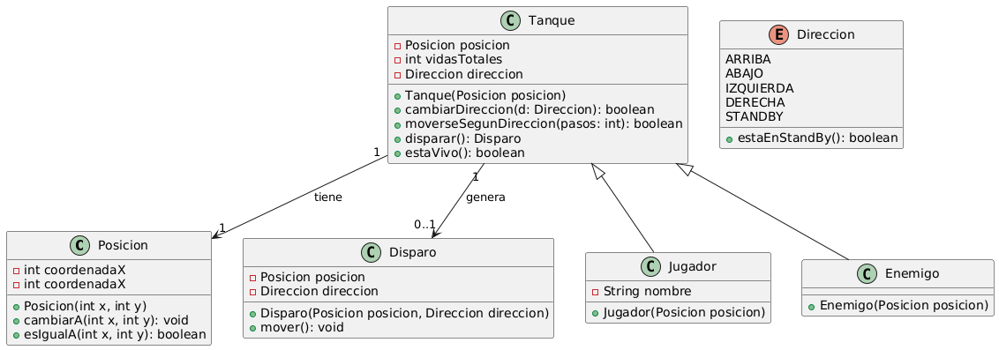

# BattleCity - Java

¡Bienvenido a BattleCity, un proyecto de simulación de tanques en Java!  
Este proyecto se centra en la lógica del juego y el modelado de clases siguiendo todos los principios
POO/Diseño antes de incorporar la interfaz gráfica.

---

## Descripción

El objetivo es crear un juego estilo "Battle City", donde jugadores y enemigos se mueven por un tablero, disparan y reciben daño.  
El proyecto sigue un enfoque **orientado a objetos**, con pruebas unitarias y UML para planificar las relaciones entre entidades.

---

## Estructura del Proyecto

- **Tests**
    - Cada clase cuenta con pruebas unitarias (`JUnit`) para validar comportamiento de movimiento, daño, dirección y más.
    - Cobertura actual: ~83%.

- **UML**
    - Diagrama principal de clases y relaciones, incluyendo herencia y composición.
    - Documentado en PlantUML (`.puml`).


## Requisitos

- Java 17+
- IDE recomendado: IntelliJ IDEA
- Maven para gestión de dependencias y compilación

---

## Ejecución

1. Clonar el repositorio(por ahora, luego se definira mejor):
   ```bash
   git clone https://github.com/tuusuario/tank-game.git
